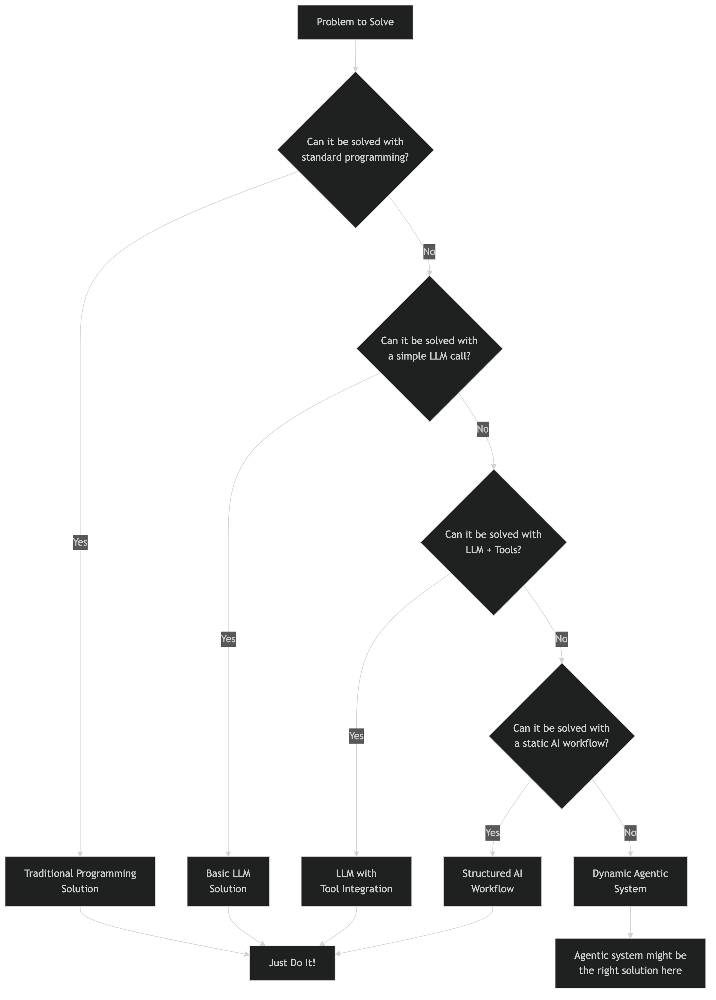

# Do You Know What Agents Are?

Everyone related to the tech industry certainly heard a lot of hype around agentic AI, agent communication protocols and multi agent systems. It’s a topic you see every day in the news, social media, and everyone is talking about it, but do you even know what AI agents are? Would you define a simple large language model call as AI agent? How about a large language model with some tools? Does the language model need to perform actions in the form of write operations to be an agent?

In the following I will share my view of what makes artificial intelligence agentic and when I would implement such systems. While my definition originates from the academic definition of an intelligent agent, it's my personal interpretation based on my experience with generative AI and agentic systems. All the following is related to agentic systems in the context of large language models (LLMs) and not necessarily applicable to other AI systems.

## Academic Definition

An intelligent agent was defined as system which “percepts from the environment and perform actions” in the book [Artificial Intelligence: A Modern Approach by Stuart Russell and Peter Norvig](https://www.magradze.de/academics/CS550/Russel_AI.pdf) which was initially published in 1995. The book explains the concept on the example of a vacuum cleaner which is widely taught in computer science courses. I learned about this definition in university before large language models were a thing, but I think it still is a good starting point to understand what an agent is.

The classic vacuum cleaner world consists of the following components:

- **Environment**: A simple grid illustrating the world with dirt and empty spaces.
- **Perception**: The vacuum cleaner can sense its current position and whether there is dirt in that position.
- **Actions**: The vacuum cleaner can move to adjacent positions and clean the dirt in its current position.

The solution here was implemented as a simple rule-based system, which is not what most people these days would refer to as agentic AI. The vacuum shows autonomy, not intelligence: it applies simple rules to sensor readings to choose actions. Nevertheless, the definition of agents based on perception of an environment with the freedom to choose actions based on that resonates with me, if this is truly an "intelligent" agent is a topic for another day.

I would translate this concept to the world of large language models with the following components:

- **Environment**: The complete conversational context (message history, system prompts), which might contain any information which can be represented as text. This can be a simple user message, the response to a SQL query, or even a textual representation of a graph. Multimodal models widen the scope of this environment but do not fundamentally change it.
- **Perceive**: Interpretation of the converstational context, which could be extracting relevant information from the message history, understanding the intent of the user, or recognizing patterns in the data. I would also consider capability assessment in the form of tool availability and tool capabilities as part of the perception.
- **Act**: Selection of the next action based on the available tools and the current context. The response is technically always just text, but frequently it's a structured response which is then interpreted by the system to perform an action. I would not consider a simple text response as an action, but if a tool is executed based on the response, I would consider this an action. This could be a SQL query, a file write operation, or any other action which is not just a text response.

## Specific Examples

### Simple LLM Call

When the user asks a question and the model responds with a textual message. This I would clearly not consider an agentic system, as there is only a very limited perception of the environment (the user message) and no actions are performed beyond generating a text response. The model does not have any tools available, nor does it perform any actions.

### Retrieval-Augmented Generation (RAG)

When the users question is answered by the large language model with additional context information from a knowledge base this would be considered a retrieval-augmented generation (RAG) system. I still would not consider this an agentic system, as we only increased the perception of the environment by adding additional context information, but the model still only generates a text response without performing any actions.

### Single Tool Usage

When we define functions and describe them to the model, we can give it the ability to instruct actions based on the user input. For example, if the user asks for the current weather and the model define to call a weather API with information from the user message to finally return the weather information. This I would see as the simplest form of an agentic system, as the model can now perceive the environment (user message and tool capabilities) and perform actions (call the weather API). The model is still not intelligent, but it can now perform actions based on the user input.

### Retrieval-Augmented Generation with Tool Usage

When the model does not just retrieve knowledge from a single source but has the option to use multiple tools to retrieve information, we reach something which is called agentic RAG. In this case, the model has the ability to look up information in one or more data sources and then respond to the user with taking the retrieved information into account. This is a concept which is frequently very useful in practice, as it allows the model to retrieve information from multiple sources and combine them to provide a more comprehensive answer. I personally would not require the action to be a write operation, so I would also consider this a simple agentic system.

### Multi-Tool Usage with Reasoning

When the model can use multiple tools, reason about the results, and decide if it needs to call another tool based on the results of the previous tools, I would consider this a more advanced agentic system. For example, if the user asks to find a good Italian restaurant for a dinner date this Saturday near downtown, and book a table for two at 8 PM. An agentic system turns the request into a plan: find high-rated Italian spots downtown for Saturday at 8 PM, then try booking. It queries for candidates, loops through them checking availability, handles failures by moving to the next option, and confirms the first successful reservation. Finally, it reports the booked restaurant and details to the user. This demonstrates adaptive planning, fallback logic, and clear outcome delivery, which is frequently realised with an internal agent scratchpad, where the model can store intermediate results and use them to reason about the next action.

## Should I Implement Agentic Systems?

While agentic systems can be very useful, they are not always the best solution. In software development I would always recommend to start with the simplest solution which solves the problem and only add complexity if it is really necessary. This is especially true for systems which use large language models, as they add nondeterministic behavior.

You should always specifically define the problem you want to solve and then look for the best solution to solve that problem. If the problem can be solved with a simple LLM call, then this is the best solution. If the problem can be solved with a RAG system, then this is the best solution. If the problem can be solved with a single tool usage, then this is the best solution. If the problem can be solved with a statically defined workflow, then this is the best solution. Only if the problem requires dynamic reasoning and multiple tool usage, then an agentic system might be the best solution.

I think of AI Agents as dynamic workflows where the next action is not statically defined, but rather a set of possible actions is available, and the model can decide which action to take with freely chosen input parameters based on the current context. The scope of the available actions can even be expanded to allow the model to define code which is then executed. This is a very powerful concept, but it also adds a lot of potential for errors and unexpected behavior. Therefore, I would only implement agentic systems if the problem requires it, and if the benefits outweigh the downsides of instability and unpredictability.

## Conclusion

Agentic systems are a powerful way to build dynamic workflows: they let a model perceive its environment and act based on context. But they also introduce nondeterministic behavior, which can produce unreliable results. There is no inherent value in “going agentic” for its own sake, it is just one option to solve a specific subset of problems. Always start with the simplest solution that works and only add complexity when it is truly necessary.

Real value is not created by chasing hype, it comes from solving specific problems reliably and efficiently. Without a clear goal, no system will deliver meaningful results. Begin with the problem, define the desired outcome, then choose the technology. Reversing that order will nearly never lead to success.
