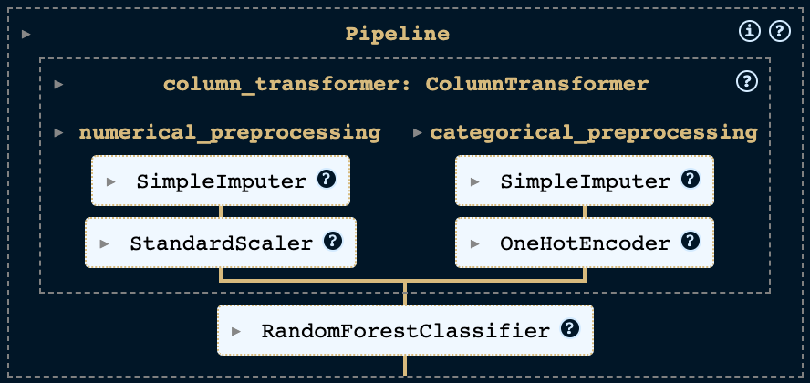
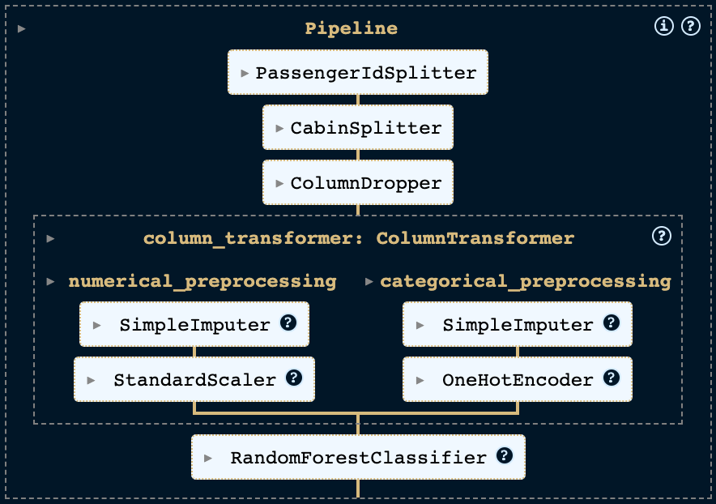

## Introduction

Practical applications of machine learning often require the use of multiple preprocessing steps before the acutal model can be trained. For example, we may need to impute missing values, scale numeric features, encode categorical features and then fit a model. scikit-learn provides a Pipeline class that allows us to encapsulate multiple steps into a single object that can be used in place of a single estimator.

<!-- more -->

With pipelines, we can structure our code in a way that is more modular and easier to maintain. We can also use pipelines to automate the process of training and evaluating multiple models with different preprocessing steps. They are particularly useful when we expect new data to arrive over time, and we want to be able to quickly retrain our model with the new data. In this post, we will learn how to use pipelines in scikit-learn.

## Prerequisites

For the code examples, we will use Python 3.11. The code is available in a [Jupyter Notebook](https://github.com/maltehedderich/blog/blob/main/notebooks/pipelines_sklearn/pipelines_sklearn.ipynb). The following libraries are required:

- [scikit-learn](https://scikit-learn.org/) - **scikit-learn** is a Python library for machine learning. It provides a wide range of machine learning algorithms and preprocessing steps.
- [pandas](https://pandas.pydata.org/) - **pandas** is a Python library for data manipulation and analysis. It provides data structures and operations for manipulating numerical tables and time series.
- [scipy](https://www.scipy.org/) - **scipy** is a Python library for scientific computing. It provides a wide range of mathematical algorithms and convenience functions built on top of NumPy.

## Dataset

We will use the [Spaceship Titanic](https://www.kaggle.com/competitions/spaceship-titanic/data) dataset from Kaggle. The dataset contains information about the passengers of a Spaceship which collided a spacetime annomaly. The task is to predict whether a passenger was transported to an alternate dimension during the Spaceship Titanic's collision with the spacetime anomaly. The dataset contains the following features:

- `PassengerId` - A unique Id for each passenger. Each Id takes the form `gggg_pp` where `gggg` indicates a group the passenger is travelling with and pp is their number within the group. People in a group are often family members, but not always.
- `HomePlanet` - The planet the passenger departed from, typically their planet of permanent residence.
- `CryoSleep` - Indicates whether the passenger elected to be put into suspended animation for the duration of the voyage. Passengers in cryosleep are confined to their cabins.
- `Cabin` - The cabin number where the passenger is staying. Takes the form `deck/num/side`, where side can be either P for Port or S for Starboard.
- `Destination` - The planet the passenger will be debarking to.
- `Age` - The age of the passenger.
- `VIP` - Whether the passenger has paid for special VIP service during the voyage.
- `RoomService`, `FoodCourt`, `ShoppingMall`, `Spa`, `VRDeck` - Amount the passenger has billed at each of the Spaceship Titanic's many luxury amenities.
- `Name` - The first and last names of the passenger.
- `Transported` - Whether the passenger was transported to another dimension. This is the target, the column you are trying to predict.

## Loading the Dataset

Let's start by loading the dataset into a pandas DataFrame. We will use the `read_csv` function from pandas to load the dataset from a CSV file. Furthermore, we will extract the target variable and split the dataset into a training and a test set.

```python
import pandas as pd
from sklearn.model_selection import train_test_split

dataset_df = pd.read_csv('../kaggle/datasets/spaceship-titanic/train.csv')

# Extract the target variable
y = dataset_df['Transported']
X = dataset_df.drop(['Transported'], axis=1)

# Split the dataset into train and test
X_train, X_test, y_train, y_test = train_test_split(X, y, test_size=0.2)
```

_This code assumes that the dataset is located in the `../kaggle/datasets/spaceship-titanic` directory. If you want to run the code yourself, you need to download the dataset from Kaggle and extract it to the specified directory or change the path._

## Creating a Basic Pipeline

Let's start by creating a basic pipeline that imputes missing values and scales numeric features. We will use the `SimpleImputer` and `StandardScaler` classes from scikit-learn. The `SimpleImputer` class replaces missing values with the mean of the feature. The `StandardScaler` class standardizes features by removing the mean and scaling to unit variance. We will use the `Pipeline` class to combine the two preprocessing steps into a single object.

```python
from sklearn.pipeline import Pipeline
from sklearn.impute import SimpleImputer
from sklearn.preprocessing import StandardScaler

numerical_preprocessor = Pipeline([
    ('imputer', SimpleImputer()),
    ('scaler', StandardScaler())
])
```

This pipeline would already work and we could transform our dataset with `numerical_preprocessor.fit_transform(X)`. However, we also have categorical features in our dataset. We need to create a separate pipeline for categorical features and combine the two pipelines into a single pipeline.

For categorical features also use the `SimpleImputer` but we replace missing values with the most frequent value of the feature. We also use the `OneHotEncoder` to encode categorical features as one-hot numeric arrays. We set `sparse_output` to `False` to get a dense array instead of a sparse matrix and `handle_unknown` to `ignore` to ignore unknown categories during transform. This is useful if we have new categories in the test set that were not present in the training set.

```python
from sklearn.pipeline import Pipeline
from sklearn.impute import SimpleImputer
from sklearn.preprocessing import OneHotEncoder

categorical_preprocessor = Pipeline([
    ('imputer', SimpleImputer(strategy='most_frequent')),
    ('encoder', OneHotEncoder(sparse_output=False, handle_unknown='ignore'))
])
```

Great, now that we have two pipelines, one for numerical features and one for categorical features, we can combine the two pipelines into a single pipeline with the `ColumnTransformer`. The `ColumnTransformer` class applies a transformer to a subset of the columns of the input data. We can specify which columns to transform with a list of tuples. Each tuple contains the name of the transformer and a list of columns to transform. Instead of passing a list of columns, we can also pass a scikit-learn selector object. For example, we can use the `make_column_selector` function to select all columns of a certain data type.

In our case we want to apply the `numerical_preprocessor` to all numeric columns and the `categorical_preprocessor` to all categorical columns. We can do this with the following code:

```python
from sklearn.compose import ColumnTransformer, make_column_selector

column_transformer = ColumnTransformer([
    ('numerical_preprocessing', numerical_preprocessor, make_column_selector(dtype_include=np.number)),
    ('categorical_preprocessing', categorical_preprocessor, make_column_selector(dtype_include=object))
])
```

Now that we have a single pipeline that can transform our data, we can add a classifier to the pipeline. We will use the `RandomForestClassifier` class from scikit-learn. The `RandomForestClassifier` class implements a random forest classifier. A random forest is an ensemble learning method that fits a number of decision tree classifiers on various sub-samples of the dataset and uses majority voting to predict the class of a sample.

```python
from sklearn.ensemble import RandomForestClassifier

pipeline = Pipeline([
    ('preprocessing', column_transformer),
    ('classifier', RandomForestClassifier())
])
```

At this point our pipeline looks like this:



We now can fit the pipeline to our training data and evaluate the model on the test data.

```python
pipeline.fit(X_train, y_train)
accuracy_score = pipeline.score(X_test, y_test)
```

This makes it very easy to train and evaluate the model when we get new data. We can simply call `pipeline.fit(X_train, y_train)` to train the model and `pipeline.score(X_test, y_test)` to evaluate the model on the test data.

With the random_state set to 22, we get an accuracy of **0.767**. This is not a bad result for a first try. However, we can probably improve the model by engineering some new features and tuning the hyperparameters of the model. Let's see how we can do this with pipelines.

## Feature Engineering and Custom Transformers

Feature engineering is the process of transforming raw data into features that better represent the underlying problem to the predictive models, resulting in improved model accuracy on unseen data. In this case the feature descriptions reveal further information which is not immediately obvious and can be used to engineer new features.

The `PassengerId` is a unique identifier for each passenger, but it is also a group identifier. While we would not expect any hidden information in a unique identifier, the group identifier could be useful. As the description states, people in a group are often family members so there might be some correlation between the group identifier and the target variable. We can extract the group identifier from the `PassengerId` and add it as a new feature.

The `Cabin` column contains information about the deck, room number, and side of the ship. Here we can extract the deck and side of the ship and add them as new features.

Furthermore, we might want to remove the `Name` column as it is unlikely to be useful for predicting the target variable.

These steps are quite specific to this dataset and therefore it's unlikely to find a transformer in scikit-learn that does exactly what we want. However, we can easily create our own transformer by subclassing the `BaseEstimator` and `TransformerMixin` classes from scikit-learn. The `TransformerMixin` class provides a `fit_transform` method that calls `fit` and `transform` on the transformer. The `BaseEstimator` class provides a `get_params` and `set_params` method that are used by scikit-learn to get and set the parameters of the transformer.

### Custom Transformers

Let's start by splitting the `PassengerId` into the group identifier and the passenger number. To do that we create a new class called `PassengerIdSplitter` that inherits from the `BaseEstimator` and `TransformerMixin` classes. We then implement the `fit` and `transform` methods. The `fit` method is used to fit the transformer to the data and the `transform` method is used to transform the data. In this case we don't need to fit the transformer to the data as the outcome is independent of the other rows. Therefore, we simply return `self` in the `fit` method. In the `transform` method we split the `PassengerId` into the group identifier and the passenger number and add them as new features. We then drop the original `PassengerId` column and return the transformed DataFrame.

```python
import pandas as pd

from typing import Self
from sklearn.base import BaseEstimator, TransformerMixin

class PassengerIdSplitter(BaseEstimator, TransformerMixin):
    """Split the PassengerId into Group and Number"""

    def fit(self, X: pd.DataFrame, y=None) -> Self:
        return self

    def transform(self, X: pd.DataFrame) -> pd.DataFrame:
        # Split the PassengerId into Group and Number
        identifier_split = X['PassengerId'].str.split('_', expand=True)
        identifier_split.columns = ['Group', 'Number']

        # Concatenate the new columns
        X = pd.concat([X, identifier_split], axis=1)

        # Drop the original column
        return X.drop(['PassengerId'], axis=1)
```

The logic for the `Cabin` column follows a similar pattern. We create a new class called `CabinSplitter` that inherits from the `BaseEstimator` and `TransformerMixin` classes. We then implement the `fit` and `transform` methods. In the `fit` method we return `self` as we don't need to fit the transformer to the data. In the `transform` method we split the `Cabin` column into the deck, room and side of the ship and add them as new features. Furthermore, we transform the room number into a numeric feature to avoid categorical features with a large number of categories (high cardinality). We then drop the original `Cabin` column and return the transformed DataFrame.

```python
import pandas as pd

from typing import Self
from sklearn.base import BaseEstimator, TransformerMixin

class CabinSplitter(BaseEstimator, TransformerMixin):
    """Split the Cabin into Deck, Room and Side"""

    def fit(self, X: pd.DataFrame, y=None) -> Self:
        return self

    def transform(self, X: pd.DataFrame) -> pd.DataFrame:
        # Split the Cabin into Deck, Room and Side (port or starboard)
        cabin_df = X['Cabin'].str.split('/', expand=True)
        cabin_df.columns = ['Deck', 'Room', 'Side']

        # Treat room as numerical to avoid high cardinality
        # Note: We are using numpys Int32 type to allow for missing values
        cabin_df['Room'] = cabin_df['Room'].astype("Int32")

        # Merge the new columns
        X = pd.concat([X, cabin_df], axis=1)

        # Drop the original column
        return X.drop(['Cabin'], axis=1)
```

For the `Name` column we follow the same pattern but now we allow to pass a list of columns to drop to the constructor of the transformer and only drop the specified columns within the `transform` method.

```python
import pandas as pd

from typing import Self
from sklearn.base import BaseEstimator, TransformerMixin

class ColumnDropper(BaseEstimator, TransformerMixin):
    """Drop the specified columns"""

    def __init__(self, columns):
        self.columns = columns

    def fit(self, X: pd.DataFrame, y=None) -> Self:
        return self

    def transform(self, X: pd.DataFrame) -> pd.DataFrame:
        # Drop the specified columns
        return X.drop(self.columns, axis=1)
```

### Adding the Custom Transformers to the Pipeline

Now that we have our custom transformers, we can add them to the pipeline exactly like we added the scikit-learn transformers. This leads us to the following configuration:

```python
from sklearn.ensemble import RandomForestClassifier

pipeline = Pipeline([
    ('column_dropper', ColumnDropper(columns=['Name'])),
    ('cabin_splitter', CabinSplitter()),
    ('passenger_id_splitter', PassengerIdSplitter()),
    ('preprocessing', column_transformer),
    ('classifier', RandomForestClassifier())
])
```

Our pipeline now looks like this:



If we set the same random state, fit the pipeline to our training data and evaluate the model on the test data, we get an accuracy of **0.788**. This is a quite noticeable improvement over the previous model. Let's continue by tuning the hyperparameters of the model.

## Hyperparameter Tuning

Hyperparameter tuning is the process of finding the optimal hyperparameters for a given model. They are usually set before the learning process begins. In contrast, the parameters of a model are learned during the training process. For example, in our RandomForestClassifier the number of trees is a hyperparameter and the weights of the individual trees are parameters.

Scikit-learn pipelines behave like a single estimator. Therefore, we can use the model selection methods from scikit-learn to tune the hyperparameters of our pipeline. We will use the `RandomizedSearchCV` class from scikit-learn to search for the best hyperparameters. The `RandomizedSearchCV` class implements a randomized search over parameters, where each setting is sampled from a distribution over possible parameter values. We will use the `n_estimators` and `max_depth` hyperparameters of the `RandomForestClassifier` as they are the most important hyperparameters.

To define our search space, we create a dictionary with the hyperparameters as keys and a list of possible values as values. To tune parameters which are not at the root level of the pipeline, we can use the `__` syntax with the name of the step and the name of the parameter. For example, to tune the `strategy` parameter of the `SimpleImputer` in our numerical preprocessing we can use `preprocessing__numerical_preprocessing__imputer__strategy`. We can then pass the search space to the `param_distributions` parameter of the `RandomizedSearchCV` class.

Let's tune the numerical imputer strategy as well as some important parameters of the `RandomForestClassifier`. To do that we create a search space and pass it together with the pipeline to the `RandomizedSearchCV` class. We then fit the `RandomizedSearchCV` object to the training data and evaluate the model on the test data.

For the RandomizedSearchCV we set the `n_iter` parameter to 1000 to sample 1000 different parameter combinations. We also set the `cv` parameter to 10 to use 10-fold cross-validation. We set the `refit` parameter to `True` to refit the best estimator on the entire training set. We set the `verbose` parameter to 1 to get some output during the search. Finally, we set the `n_jobs` parameter to `-1` to use all available processors.

```python
from scipy.stats import randint
from sklearn.model_selection import RandomizedSearchCV

# Define the search space
search_space = [
    {
        'column_transformer__numerical_preprocessing__imputer__strategy': ['mean', 'median', 'most_frequent'],
        'classifier__n_estimators': randint(50, 500),
        'classifier__max_depth': randint(3, 25),
        'classifier__min_samples_split': randint(2, 50),
        'classifier__min_samples_leaf': randint(1, 25),
        'classifier__max_features': ['sqrt', 'log2'],
    }
]

# Define the RandomizedSearchCV object
random_search = RandomizedSearchCV(
    extended_pipeline,
    search_space,
    scoring='accuracy',
    refit=True,
    n_iter=1000,
    cv=10,
    verbose=1,
    n_jobs=-1,
    random_state=RANDOM_STATE
)

# Fit the RandomizedSearchCV object to the training data
random_search.fit(X_train, y_train)
```

_Note: This step can take a while to run. If you want to run the code yourself, you can reduce the number of iterations to speed up the process._

The code above shows that the search_space is a list of dictionaries. This is especially useful if we want to tune multiple models with different search spaces. You can simply add another model to the list and overwrite the classifer in the pipeline and define the relevant hyperparameters to tune.

After the search is finished, we can evaluate the model on the test data.

```python
accuracy_score = random_search.score(X_test, y_test)
```

We get an accuracy of TODO: add accuracy. This is a further improvement over the previous model. We can also look at the best parameters with the `best_params_` attribute of the `RandomizedSearchCV` object.

```python
print(random_search.best_params_)
```

Which outputs the following for our random_state with `n_iter=1000`:

```python
{
    'classifier__max_depth': 10,
    'classifier__max_features': 'sqrt',
    'classifier__min_samples_leaf': 1,
    'classifier__min_samples_split': 2,
    'classifier__n_estimators': 100,
    'column_transformer__numerical_preprocessing__imputer__strategy': 'mean'
}
```

## Conclusion

In this post, we learned how to use pipelines in scikit-learn. We learned how to create a basic pipeline, how to add custom transformers to the pipeline, and how to tune the hyperparameters of the pipeline. We also learned how to use the pipeline to train and evaluate the model on new data.

Pipelines are a powerful tool for structuring our code in a way that is more modular and easier to maintain. They are particularly useful when we expect new data to arrive over time, and we want to be able to quickly retrain our model with the new data.
